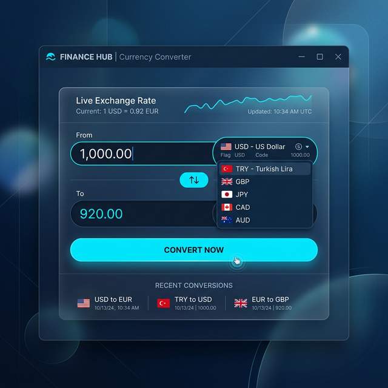
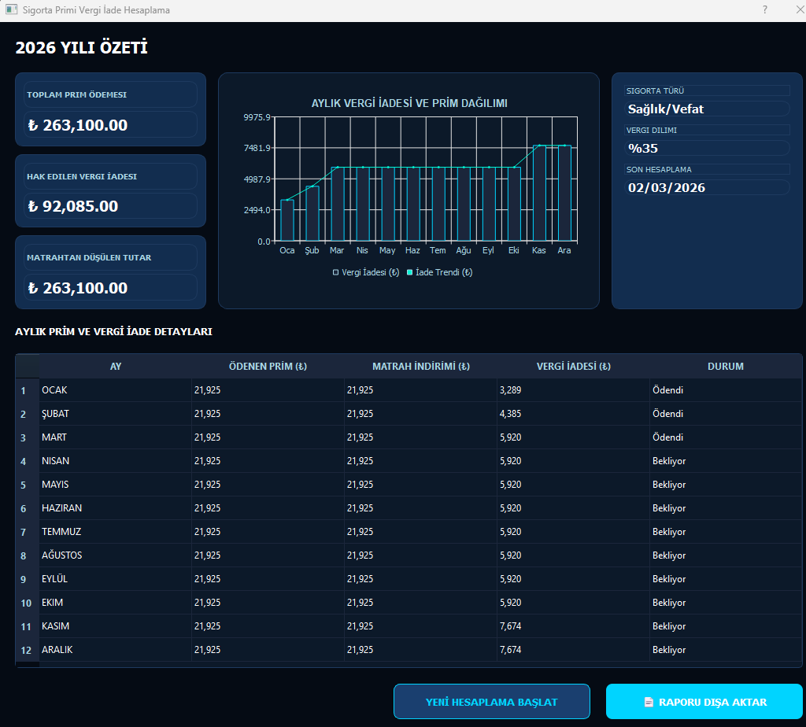
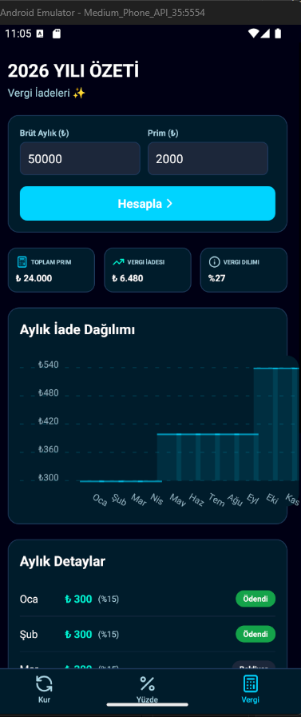

# 🏛️ Finans Asistanı

**Finans Asistanı**, Python (PyQt5) ile masaüstünde ve Native Android (Kotlin & Jetpack Compose) ile **mobil cihazlarda (Android)** çalışan, modern ve kullanıcı dostu bir finansal hesaplama aracıdır. Günlük finansal işlemlerini ister bilgisayarında ister cebinde hızlıca halletmek isteyen kullanıcılar için tasarlanmış geniş kapsamlı özelliklere sahiptir.

---

## 🚀 Öne Çıkan Özellikler

### 1. 💱 Kur Dönüşümü
*   **Canlı Veri:** `ExchangeRate API` üzerinden 150+ para birimi için anlık döviz kurları.
*   **Arama ve Seçim:** Geniş para birimi listesi içinde hızlıca seçim yapabilme.
*   **Hızlı Hesaplama:** Birim fiyatı girip saniyeler içinde karşılığını görme.

### 2. 🏛️ Vergi İadesi (Sigorta Prim Avantajı)
*   **Maaş Etkisi:** Hayat ve Şahıs Sigorta primleriniz üzerinden aylık ne kadar vergi iadesi alacağınızı net olarak görün.
*   **Vergi Dilimi Takibi:** Maaşınızın hangi ayda hangi vergi dilimine (%15, %20, %27, %35, %40) geçtiğini otomatik hesaplar.
*   **Poliçe Yönetimi:** Birden fazla poliçeyi (USD veya TRY bazlı) tek bir hesaplamaya ekleme.
*   **Detaylı Rapor:** ASCII tablo formatında şık aylık döküm ve kopyalanabilir sonuç ekranı.

### 3. 📊 Yüzde Hesaplayıcı
*   Değerin %X'i kaçtır?
*   Değerden %X çıkarılırsa sonuç ne olur? (İndirim)
*   Değere %X eklenirse sonuç ne olur? (Artış)
*   Değer, diğer değerin yüzde kaçıdır?
*   Bir değerden diğerine yüzde kaç değişim olmuştur?

### 4. 📈 Bileşik Kar Hesaplayıcı
*   İlk yatırım, aylık katkı ve süre belirleyerek uzun vadeli birikim simülasyonu.
*   Varyans aralığı (±%) ile düşük ve yüksek senaryo karşılaştırması.
*   Günlük, Haftalık, Aylık, 3 Aylık, 6 Aylık veya Yıllık bileşik frekans seçimi.
*   Yıllara göre bakiye gelişim grafiği ve detaylı yıllık döküm tablosu.

---

## 🎨 Tema ve Görsel Deneyim
Uygulama, göz yormayan ve premium hissettiren 5 farklı tema seçeneği ile gelir:
*   **Okyanus (Varsayılan):** Modern lacivert ve turkuaz tonları.
*   **Koyu Mavi:** Derin gece mavisi ve vurgulu renkler.
*   **Sade:** Temiz beyaz ve mavi profesyonel görünüm.
*   **Orman:** Rahatlatıcı yeşil tonları.
*   **Günbatımı:** Turuncu ve morun sıcak uyumu.

---

## 🛠️ Teknik Özellikler
*   **Kaldığın Yerden Devam:** Uygulama, en son kullandığın temayı ve en son hangi sekmede (Kur, Yüzde, Vergi) olduğunu hatırlar.
*   **Hız:** Tüm hesaplamalar yerel kod üzerinde milisaniyeler içinde gerçekleşir.







---

## 📦 Kurulum ve Çalıştırma

### Yöntem 1: Doğrudan Kurulum (Hazır Paketler)
*   💻 **Windows (.exe):** `dist/FinansAsistani.exe` dosyasını indirip hiçbir kurulum yapmadan doğrudan çalıştırabilirsin.
*   📱 **Android (.apk):** Proje içerisindeki `apk_yap.ps1` veya `apk_yap.bat` betiğini çalıştırarak kendi cihazınıza kurabileceğiniz APK dosyasını tek tıkla üretebilirsiniz (Detaylar Yöntem 4'te).

### Yöntem 2: Python ile (Kaynak Koddan)
1. Python'ın yüklü olduğundan emin ol.
2. Gerekli kütüphaneleri yükle:
   ```bash
   pip install PyQt5 requests PyQtChart
   ```
3. Uygulamayı başlat:
   ```bash
   python calculators.pyw
   ```

### Yöntem 3: Kendin EXE Oluştur
PyInstaller ile tek dosyalık çalıştırılabilir oluşturabilirsin:
```bash
pyinstaller --onefile --noconsole --name "FinansAsistani" calculators.pyw
```

### Yöntem 4: 📱 Mobil Uygulama (Kotlin & Jetpack Compose)
Masaüstü deneyimini cebine taşı! Modern Android geliştirme standartları (Kotlin ve Jetpack Compose) kullanılarak geliştirilen yüksek performanslı yerel (native) Android sürümünü saniyeler içinde derleyebilirsin.

Uygulamayı derlemek (APK veya AAB oluşturmak) için özel hazırlanmış, tek tıkla çalışan scriptler bulunur:
1. **APK Oluşturmak İçin (Manuel Kurulum):** Proje içerisindeki `apk_yap.ps1` (veya `.bat`) dosyasını çalıştırın. Çıktı olarak `app-release.apk` dosyası üretilecektir.
2. **Play Store (AAB) İçin:** Proje içerisindeki `aab_yap.ps1` (veya `.bat`) dosyasını çalıştırın. Çıktı olarak `app-release.aab` dosyası üretilecektir.

> **Not:** Derleme işlemleri Gradle kullanır. Yerel ve ortak bir önbellek (`_cache`) mimarisi kullanılarak hızlı ve optimize bir derleme süreci sunulur. Test etmek için Android Studio kullanarak `mobile-kotlin` klasörünü açabilir ve doğrudan emülatörde çalıştırabilirsiniz.

---

## 📜 Lisans
Bu proje geliştirme ve kişisel kullanım amaçlıdır. Verilerin doğruluğu için lütfen resmi finansal kaynakları da kontrol ediniz.

**Geliştirici:** Rahman Yazgan (rahmanyazgan@hotmail.com)
